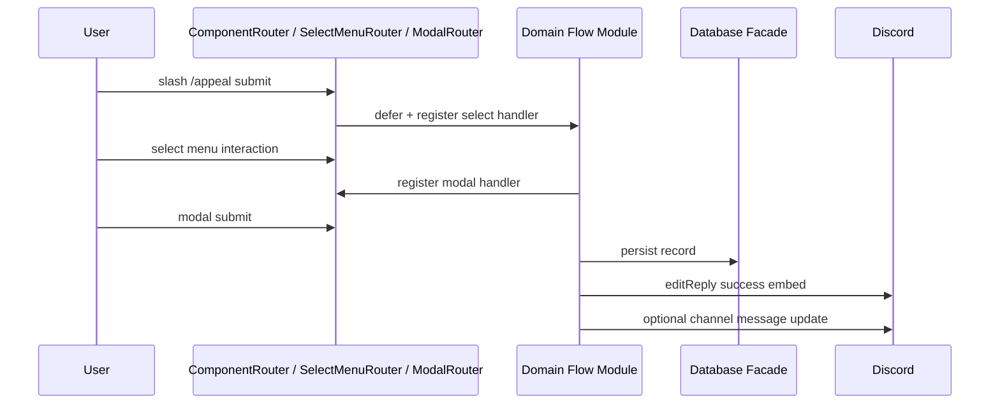

# Architecture Map

This document is the quick map for core runtime boundaries and request flow. See also [MODULE_OWNERSHIP.md](./MODULE_OWNERSHIP.md) and [TESTING_STRATEGY.md](./TESTING_STRATEGY.md).

## Runtime Boundaries

- `src/index.ts` bootstraps config, databases, responders, command/event loaders, and schedulers.
- `src/Bot` owns Discord client lifecycle, dynamic command loading, and event registration glue.
- `src/Commands` owns slash command behavior, permission constraints, and response orchestration.
- `src/Events` owns event-driven workflows that do not begin with slash commands.
- `src/Responders` owns safe interaction response lifecycle (`reply`, `defer`, `edit`, component routing).
- `src/Database` owns persistence adapters and query logic for each SQLite domain.
- `src/Systems` owns larger workflows with independent domain logic (Economy, Ticket, Giveaway, Roblox, Setup).
- `src/Utilities` owns shared formatting, API client, managers, and reusable command helpers.

## Moderation Domain Map

### Command entry points

- `src/Commands/Moderation/AppealCommand.ts` — user-facing appeal submit/history router.
- `src/Commands/Moderation/AppealAdminCommand.ts` — staff list/review/panel router.

### Appeal flows (`src/Commands/Moderation/Appeal/`)

| Module | Responsibility |
|--------|----------------|
| `AppealSubmitFlow.ts` | Thin router for submit subcommand |
| `AppealSubmitSelectFlow.ts` | Select menu → modal registration |
| `AppealSubmitModalFlow.ts` | Modal submit → DB + review channel creation |
| `AppealReviewFlow.ts` | Thin router for `HandleList` / `HandleReview` slash paths |
| `AppealReviewResolveFlow.ts` | Approve/deny button + modal finalize handlers |
| `AppealFormatters.ts` | List pages, resolved review embeds |
| `AppealShared.ts` | Cross-flow helpers (permissions, notify, remove action) |
| `AppealPanelFlow.ts` | Staff appeal panel button |

**Tests:** `tests/commands/AppealCommand.test.ts`, `tests/commands/AppealAdminCommand.test.ts`, `tests/commands/Appeal/AppealReview.lifecycle.test.ts`

### Moderation command splits

| Folder / file | Responsibility |
|---------------|----------------|
| `Lockdown/ApplyFlow.ts`, `LiftFlow.ts` | Channel overwrite lockdown apply/lift |
| `RaidMode/ActivateFlow.ts`, `DeactivateFlow.ts`, `StatusFlow.ts`, `ClearRaidMode.ts` | Raid mode lifecycle |
| `Casefile/QueryFlow.ts`, `Formatters.ts` | Casefile query + embed formatting |
| `shared/OverwriteSerialization.ts` | Serialize/restore channel permission overwrites |

**Tests:** `tests/commands/Moderation/LockdownCommand.test.ts`, `tests/commands/Moderation/RaidModeCommand.test.ts`, `tests/commands/Moderation/CasefileCommand.test.ts`

### Persistence

- `src/Database/ModerationDatabase.ts` — moderation persistence facade.
- `src/Database/Moderation/Stores/` — `TempActionStore`, `ModerationEventStore`, `AppealStore`.

## Utility Domain Map

### Giveaway (`src/Commands/Utility/Giveaway/`)

| Module | Responsibility |
|--------|----------------|
| `GiveawayCreateFlow.ts` | Create giveaway message + register entry button |
| `GiveawayEndFlow.ts` | End active giveaway, pick winners |
| `GiveawayRerollFlow.ts` | Reroll ended giveaway winners |
| `GiveawayListFlow.ts` | List active giveaways embed |
| `GiveawayShared.ts` | Shared helpers (entry count update, staff checks) |

**System:** `src/Systems/Giveaway/GiveawayEntryHandler.ts` — entry/leave button handler; `GiveawayManager.ts` — persistence + winner selection.

**Tests:** `tests/commands/Giveaway/Giveaway.lifecycle.test.ts`, `tests/systems/Giveaway/GiveawayEntryHandler.test.ts`

### Poll (`src/Commands/Utility/Poll/`)

| Module | Responsibility |
|--------|----------------|
| `CreateFlow.ts` | Create poll message + vote buttons |
| `EndFlow.ts` | End poll and tally |
| `ListFlow.ts` | List active polls |
| `PollShared.ts` | Shared poll helpers |

**Tests:** `tests/commands/Utility/PollCommand.test.ts`

### Setup wizard (`src/Systems/Setup/`)

Six-step wizard: welcome → staff roles → feature modules → support/logging → community → review.

```
constants.ts, state.ts (draft + step state)
  → steps/ (per-step embed + component builders)
  → features/FeatureModules.ts (economy, leveling, starboard, verification, giveaways)
  → builders/ (components, embed, formatters, navigation)
  → handlers/selectHandlers.ts (role/channel selects)
  → handlers/buttonHandlers.ts (next/back/save/cancel)
  → handlers/featureToggleHandlers.ts (feature on/off toggles)
  → persistence/SaveSetupDraft.ts, SyncDraftFromSavedSettings.ts
```

**Tests:** `tests/systems/Setup/selectHandlers.lifecycle.test.ts`, `tests/systems/Setup/components.lifecycle.test.ts`, `tests/systems/Setup/SaveSetupDraft.test.ts`, `tests/commands/Utility/SetupCommand.test.ts`

### MessageCreate handlers (`src/Events/MessageCreate/`)

| Module | Responsibility |
|--------|----------------|
| `RunMessageCreateHandlers.ts` | Runs registered handlers in order; `"stop"` short-circuits the chain |
| `ChatXpHandler.ts` | Awards chat XP when leveling is enabled |
| `LinkFilterHandler.ts` | Deletes blocked links based on guild settings |
| `TicketMessageHandler.ts` | Persists ticket channel messages |

**Tests:** `tests/events/MessageCreate/RunMessageCreateHandlers.test.ts`

## Economy Game Pattern

Economy minigames follow a consistent shape:

1. Slash subcommand handler in `src/Systems/Economy/handlers/` receives interaction.
2. Handler registers follow-up buttons via `context.responders.componentRouter.RegisterButton`.
3. Pure logic lives in `src/Systems/Economy/utils/` (`blackjackLogic.ts`, `crashLogic.ts`, `scratchLogic.ts`).
4. Tests use `tests/helpers/economyInteraction.ts` to capture button handlers and drive multi-step flows.

**Tests:** `tests/systems/Economy/crashLogic.test.ts`, `tests/systems/Economy/scratchLogic.test.ts`, economy handler tests under `tests/systems/Economy/`

## Cooldown Persistence

| Piece | Location |
|-------|----------|
| In-memory state | `src/Commands/Middleware/CooldownState.ts` |
| Middleware | `src/Commands/Middleware/CooldownMiddleware.ts` |
| SQLite table | `server.db` → `command_cooldowns` via `ServerDatabase` |
| Opt-in env | `COOLDOWN_PERSIST=1` |

**Tests:** `tests/commands/Middleware/CooldownMiddleware.test.ts`

## Database migrations (`src/Database/Migrations/`)

| Piece | Location |
|-------|----------|
| Runner | `MigrationRunner.ts` — tracks applied migrations in a `_migrations` table |
| Server migrations | `Migrations/server/index.ts` — column backfills for `server.db` |
| Ticket migrations | `Migrations/ticket/index.ts` — schema changes for `tickets.db` |
| Helpers | `AddTableColumnIfMissing`, `AddTableColumnsIfMissing` |

Each database facade calls `RunMigrations(...)` in its constructor. Fresh installs get the full schema from `CreateTables`; migrations only alter existing databases.

**Tests:** `tests/database/MigrationRunner.test.ts`, `tests/database/ServerMigrations.test.ts`

## Roblox Bridge (`src/Systems/Roblox/`)

| Module | Responsibility |
|--------|----------------|
| `bridge.ts` | Re-exports + `EnsureAdminAccess` (backward compatible entry) |
| `bridgeSettings.ts` | `EnsureRobloxBridgeSettings`, `BuildApiKeySetupUrl` |
| `bridgeApi.ts` | Kick/API key/group HTTP helpers |
| `bridgePresence.ts` | `FindPlayerPresence` |
| `bridgeEmbeds.ts` | `BuildStatusEmbed`, `ExtractErrorMessage` |
| `handlers/` | Slash subcommand handlers (kick, status, group audit, etc.) |

**Tests:** `tests/systems/Roblox/bridgeApi.test.ts`, `tests/commands/RobloxApiKeyCommand.test.ts`

## Request Flow

### Standard slash command

1. Discord emits an interaction.
2. `RegisterEvents` or interaction handlers route to command/event implementation.
3. Middleware chain runs (`AutoMiddleware` from command `config`: logging, guild-only, command enabled, optional feature gate, permissions, cooldowns, error handling).
4. Command executes through responder utilities and database facade(s).
5. Domain helpers in `Utilities` format embeds/components and enforce shared logic.
6. Database facades delegate to domain stores and return typed records.
7. Response is emitted via responder wrappers to prevent raw Discord API lifecycle mistakes.

### Multi-step interaction (select → modal → DB → edit)



Appeal submit, Setup wizard, Giveaway entry, Economy bet sessions, and Ticket open all follow variants of this pattern.

## Bootstrap system registration

Global button, select, and modal handlers that must exist before commands run are registered through [`SystemRegistry.ts`](../src/Bootstrap/SystemRegistry.ts).

1. Export a `RegisterXxx(context)` function from your system module.
2. Append it to `SYSTEM_REGISTRARS` in `SystemRegistry.ts`.
3. Keep command-scoped registrations (for example Setup wizard steps registered when `/setup` runs) inside the command — only **bootstrap-wide** handlers belong in the registry.

Custom ID prefixes should stay namespaced (`ticket:`, `appeal:`, `verification-panel:`, `economy:`) to avoid router collisions.

## Database and Scaling Notes

Persistence uses **better-sqlite3** (synchronous SQLite) via facades such as [`ServerDatabase.ts`](../src/Database/ServerDatabase.ts) and per-domain stores under `src/Database/*/Stores/`.

- Suitable for a **single bot process** with moderate read/write volume.
- SQLite calls run on the Node.js main thread; heavy queries can block the event loop.
- Reconsider the storage layer if you need multiple bot instances writing concurrently, very high write throughput, or cross-process replication.

For a single-guild or small multi-guild deployment, the current facade + store pattern is intentional and keeps command code simple.

## Configuration Flow

1. `LoadAppConfig()` validates hard-required startup vars.
2. `LoadApiConfig()` resolves optional third-party API endpoints and credentials.
3. `ListMissingRequiredFeatureApiKeys()` logs missing optional feature credentials at startup.
4. Commands call config guards before external API requests and fail safely for end users.
